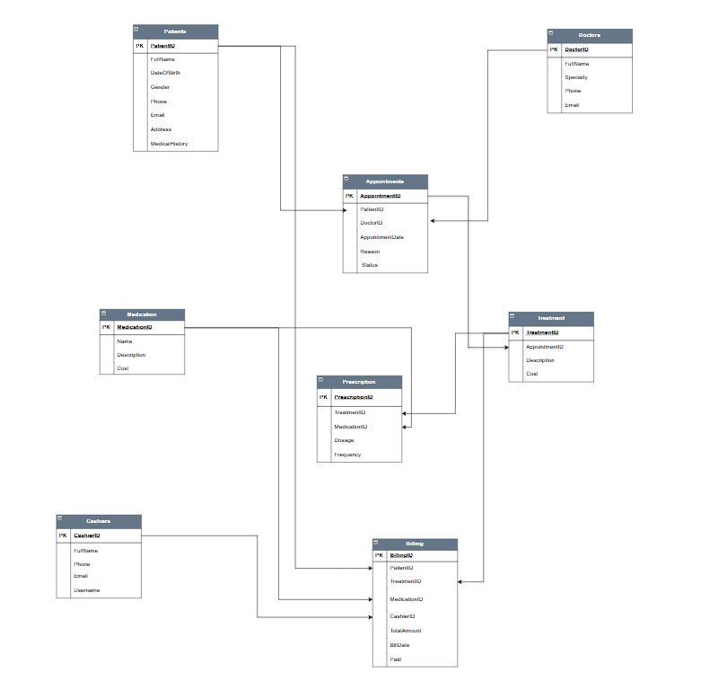
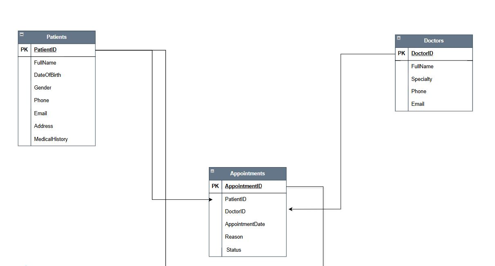
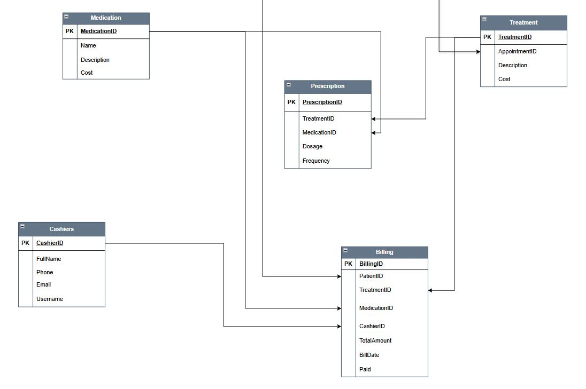
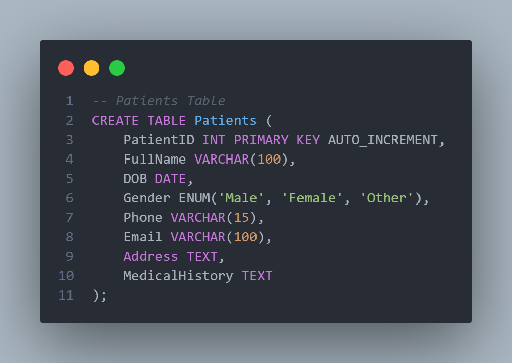
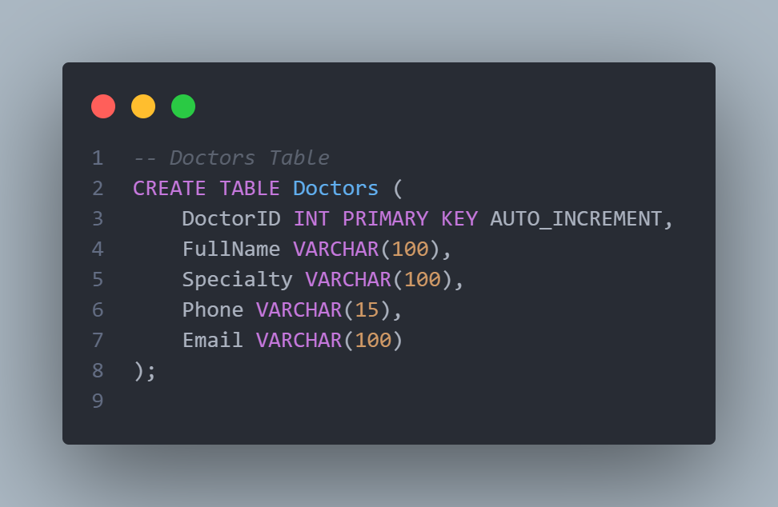
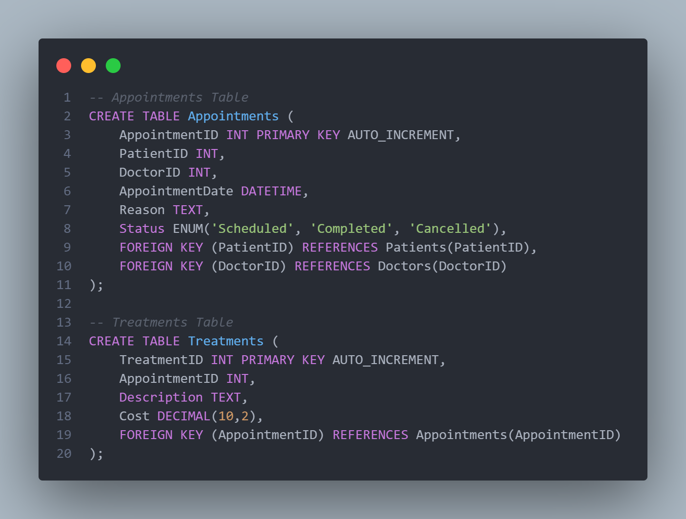

# 🏥 Hospital Management Database Project

This project presents a structured and practical SQL-based Hospital Management System with full database setup, sample data, and analytics-driven insights. It includes Entity-Relationship diagrams, modular SQL scripts, and a detailed query dashboard for generating business intelligence.

---

## 📁 Project Structure

```bash
hospital-management-db/
├── er_diagrams/
│   ├── er_diagram1.png
│   ├── er_diagram2.png
│   └── er_diagram3.png
├── sql_snippets/
│   ├── create_tables.sql
│   ├── insert_dummy_data.sql
│   ├── data_insights.sql
│   ├── snippet1.sql
│   ├── snippet2.sql
│   └── ... (other snippets)
├── README.md
```

---

## 📌 Overview

This project demonstrates how to design and implement a simple but powerful hospital management system using SQL. It covers:
- Database schema creation
- Dummy data insertion for testing
- Insightful queries for real-world dashboard reporting
- ER Diagrams to visualize data relationships

The solution is suitable for educational purposes, research, and small clinic implementation.

---

## 🗂 ER Diagrams

These diagrams illustrate how the database entities relate to one another:


<br/> </br>




---


---

## 🗂 SQL CODE SNIPPET

These diagrams shows how the database tables were created:

1.  
2. 
3. 

---

## 💾 SQL Scripts

### 1. Database Creation
File: [`create_tables.sql`](https://github.com/your-username/your-repo/blob/main/sql_snippets/create_tables.sql)

This script contains the full schema definition including:
- Patients, Doctors, Appointments, Treatments
- Medications, Prescriptions, Cashiers, Billing

### 2. Dummy Data Insertion
File: [`insert_dummy_data.sql`](https://github.com/your-username/your-repo/blob/main/sql_snippets/insert_dummy_data.sql)

This populates the database with sample records for realistic testing.

### 3. Data Queries and Insights
File: [`data_insights.sql`](https://github.com/your-username/your-repo/blob/main/sql_snippets/data_insights.sql)

Includes 20 well-crafted SQL queries that generate insights for a potential dashboard such as:
- Total number of patients
- Revenue trends
- Treatment popularity
- Medication usage and more

---

## 📊 Insight Examples

Here are a few example queries included:

- `Total number of appointments per month`
- `Most prescribed medications`
- `Top 5 busiest doctors`
- `Outstanding bills count and total amount`
- `Revenue generated by each cashier`

Each insight query is written in standard SQL and can be directly executed in any MySQL-compatible interface.

---

## 🛠 How to Reproduce

1. Clone the repository:
   ```bash
   git clone https://github.com/your-username/your-repo.git
   cd your-repo
   ```

2. Open your MySQL or SQL GUI (e.g., MySQL Workbench or phpMyAdmin)

3. Run the scripts in order:
   - `create_tables.sql`
   - `insert_dummy_data.sql`
   - `data_insights.sql`

4. View your data or generate dashboards using the output.

---

## 🙋‍♀️ Contributing

Feel free to fork the repository, suggest changes, or submit a pull request to expand the project.

---

## 📜 License

This project is released under the MIT License.
